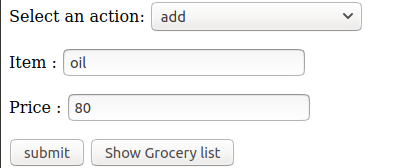
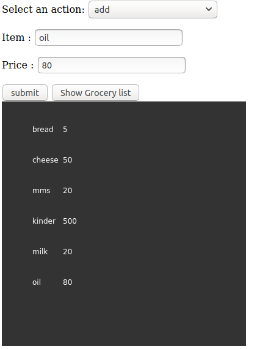

This is a very simple code for a basic web application that allow a user to fill up and manage a grocery list.
- NodeJS (Express) is used for the backend. 
- ps5.js library for the frontend. 

To test the tool, launch the appropriate node (app.js), then connect to localhost on port 8080. 
You will see the following interface: 

add the element to the grocery list then click on submit. 
To see the grocery list, click on Show Grocery List and you will get the following result: 

Note: this code was just made to test knowledge, and it's not good in terms of security, routing...
